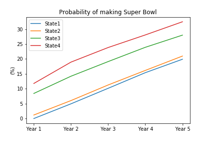

# Tanking in the NFL: An Analysis Using Markov Chains
This analysis looks at whether tanking in the NFL could possibly be successful over an average GM's tenure over simply remaining in a mediocre state.

## Preface
The [average tenure of a head coach](https://www.businessinsider.com/coaches-managers-tenure-nfl-mlb-nba-nhl-premier-league-2016-12) in 
the NFL is 4.3 years. As the rise of tanking has occurred in sports like the MLB and especially the NBA (with the 76ers), a question 
comes to mind: could tanking work in the NFL?

By creating markov chains to analyse the probability of a certain team changing states (e.g. a bottom-5 team becoming a team that plays in the Super Bowl the very next year), we can figure out if a team that tanks - that is, completely bottoms out and becomes among the worst in the league - has a higher probability of making the Super Bowl the next year than a team that is stuck in mediocrity.

## Disclaimers
This analysis does have some flaws:
* The analysis assumes that each GM and organization are equally competent. In practice, this is not the case - teams can have unpredictable ownership that can disrupt the ability of the GM to make good decisions (could pressure GM to draft/sign different players than GM wants). Teams can also simply have GMs that are simply just, well, bad - they can't evaluate talent or construct a roster even when they have a lot of organizational support. This results in teams that are consistently bad, and whose chance of improving is significantly reduced.
* The analysis assumes that each team has the same resources to attract free agents and re-sign drft picks. This just isn't the case in reality - whether it's location, city life (or lack thereof), or simply the culture of the team, players are often drawn to and repelled from certain organizations more than others. As a result, certain GMs may be inheriting an organization that either will boost their chances of improving their overall roster or could reduce their chances, depending on what the situation surrounding that organization is.

## Analysis #1: 4 states

## Analysis #2: 5 states

## Analysis #3: 7 states

